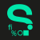

<p align="center">
  
  <h3 align="center">Sourcerer Profile Chart</h3>
    
  <p align="center">       </p>

  <p align="center">
    This repository generates sourcerer profile chart png from website ✨
    </br>
    <a href="https://github.com/avisionx/sourcerer-profile-chart/#table-of-contents"><strong>Explore the docs »</strong></a><br/>
    <a href="https://github.com/avisionx/">View Demo</a>
    .
    <a href="https://github.com/avisionx/sourcerer-profile-chart/issues">Request Feature</a>
  </p>
</p>

<!-- TABLE OF CONTENTS -->

## Table of Contents
- [Add to your Profile](#add-to-your-profile)
- [About the Project](#about-the-project)
  - [Built With](#built-with)
- [Getting Started](#getting-started)
  - [Prerequisites](#prerequisites)
  - [Installation](#installation)
- [Usage](#usage)
- [Roadmap](#roadmap)
- [Contributing](#contributing)
- [License](#license)
- [Contact](#contact)

<!-- ADD TO YOUR PROFILE -->

## Add to your Profile
Easiest way to add chart to your Github like [https://github.com/avisionx](https://github.com/avisionx) is by creating a pull request and adding your username in `username.js`. I'll merge the PR really soon then you can simply go on using your own chart like shown below in [Usage](#usage) section, it will be updated weekly and will be free forever :smile: or to set it up yourself goto [Installation](#installation) section.

<!-- ABOUT THE PROJECT -->

## About The Project


There are a lot of stats tracker for Github Readme available online, however, I didn't find one that was free and covered all data so I extracted one from sourcerer.io

Here's why:

- Cause I needed it, Duh!
- Also free to host and use :smile:

### Built With

This project was built with nodejs and is powered by github actions for cron job tasks. 🤩

<!-- GETTING STARTED -->

## Getting Started

To get up and running with this project on your local machine follow these simple steps.

### Prerequisites

Here's a list of things you'll need to have prior to generating the stats

- Account on Sourcerer like so [https://sourcerer.io/avisionx](https://sourcerer.io/avisionx)
- Node Js v8+

### Installation

1. Clone the repo

```sh
$ git clone https://github.com/avisionx/sourcerer-profile-chart.git
```

2. Install node packages

```sh
$ npm install
```

3. Change/Add your `sourcerer_username` in `usernames.js` to generate statistics for yourself.

```js
usernames = ["avisionx"]; // for single user
usernames = ["avisionx", "another_user", "many_more" ...] // for multi_user
```

4. Generate image

```sh
$ npm start
```


<!-- USAGE -->

## Usage

Use Raw image from Github replace `avisionx` with your username if you have cloned the repo entirely else replace `avisionx-sourcerer-chart.png` only.

```

```

<p align="center">OR</p>

```

```

<!-- ROADMAP -->

## Roadmap

See the [open issues](https://github.com/avisionx/sourcerer-profile-chart/issues) for a list of proposed features (and known issues).

<!-- CONTRIBUTING -->

## Contributing

Contributions are what make the open source community such an amazing place to be learn, inspire, and create. Any contributions you make are **greatly appreciated**.

1. Fork the Project
2. Create your Feature Branch (`git checkout -b feature/AmazingFeature`)
3. Commit your Changes (`git commit -m 'Add some AmazingFeature'`)
4. Push to the Branch (`git push origin feature/AmazingFeature`)
5. Open a Pull Request

<!-- LICENSE -->

## License

Distributed under the MIT License. See `LICENSE` for more information.

<!-- CONTACT -->

## Contact

Avi Garg - [https://avisionx.net/](https://avisionx.net/) - hello@avisionx.net

Project Link: [https://github.com/avisionx/sourcerer-profile-chart](https://github.com/avisionx/sourcerer-profile-chart)
